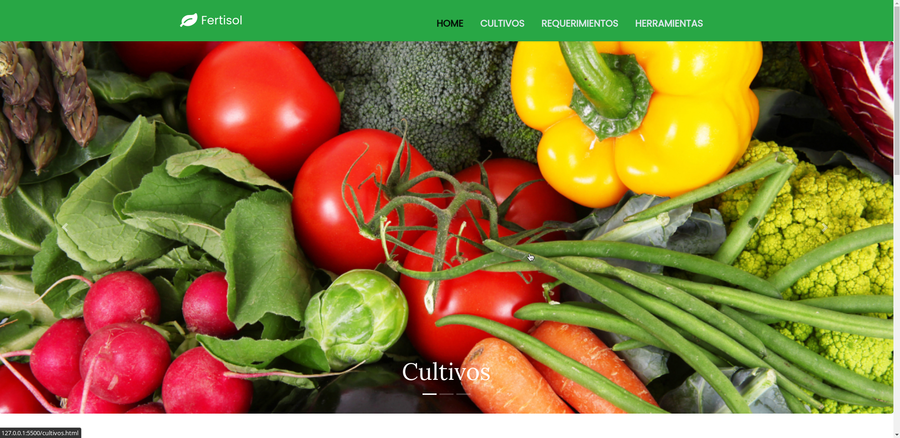
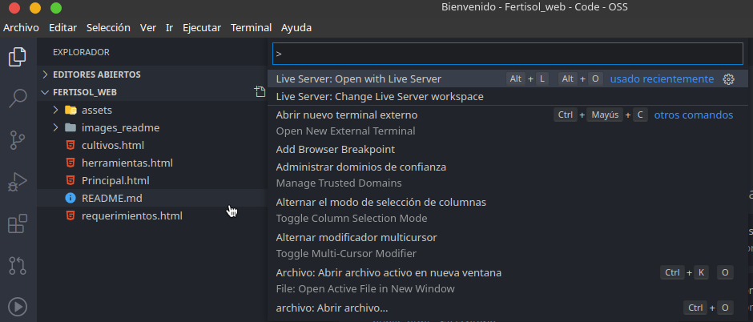

# Fertisol_web
Proyecto de Sexto Semestre, desarrollo de una pagina web sobre información de cultivos agricolas

## Instrucciones de instalación

- Descargar Vs Code.
- Descargar el plugin del Live Server.

- Clonar el repositorio.
- Abrir el repositorio con VS Code.

- abrir el Live Server con Ctrl +shif+P.

